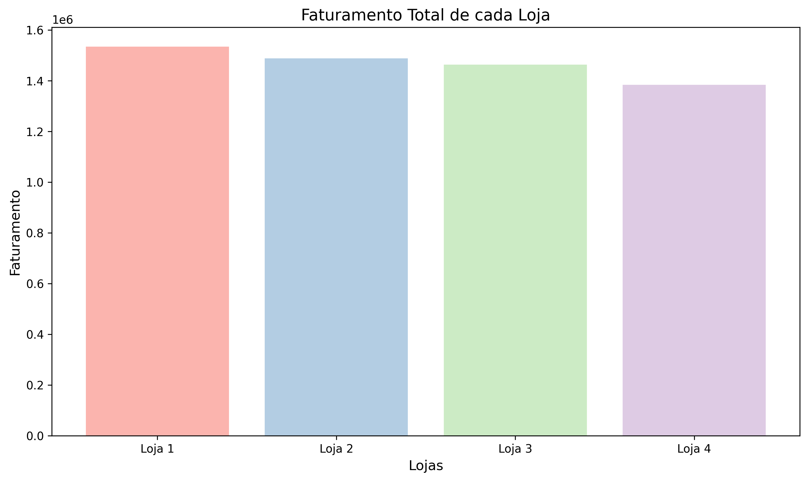
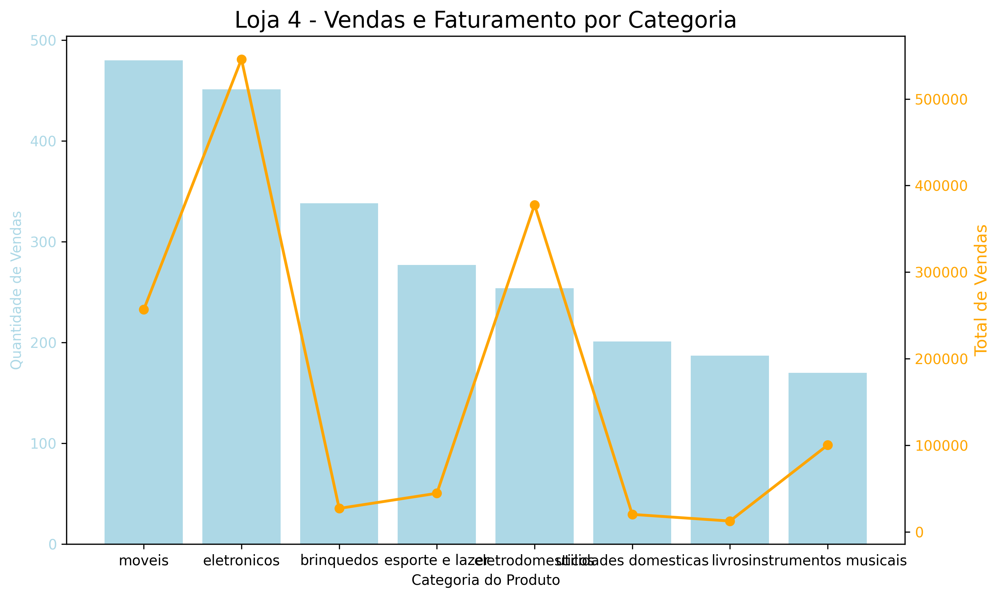
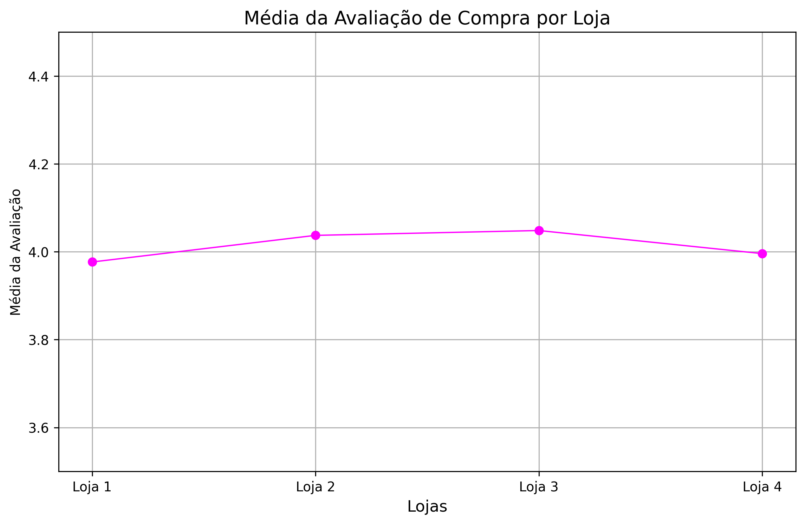
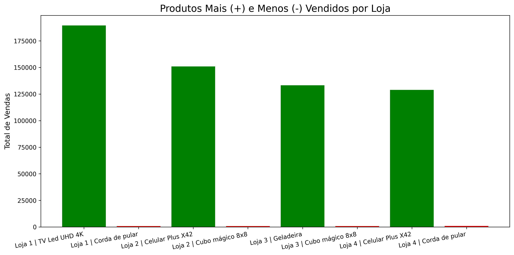
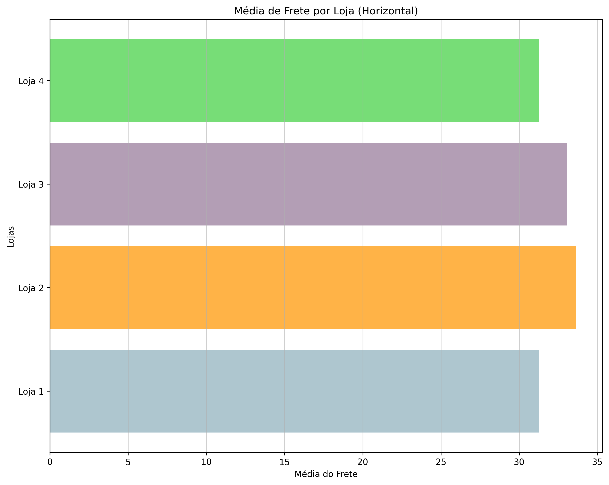
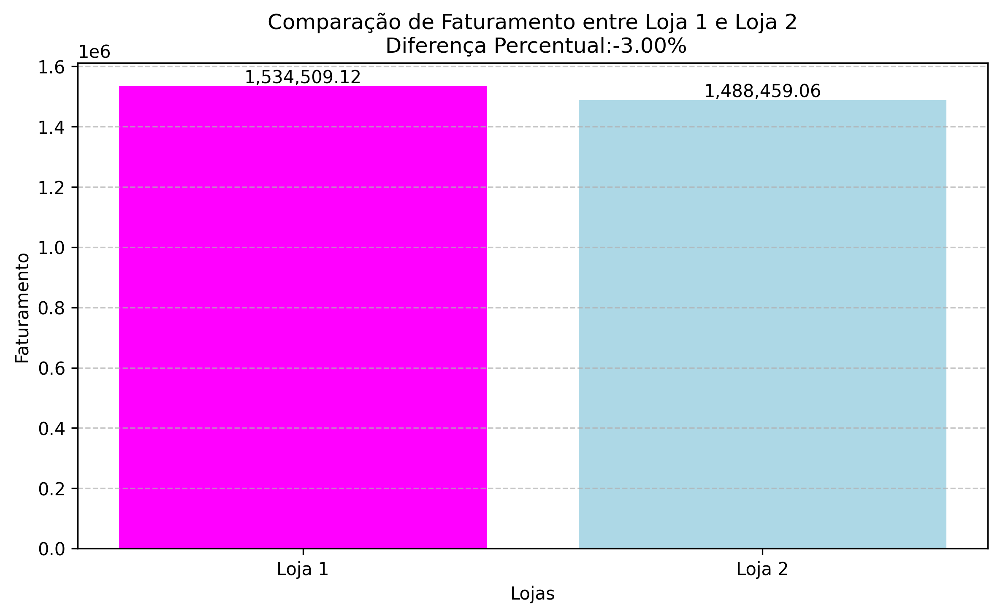
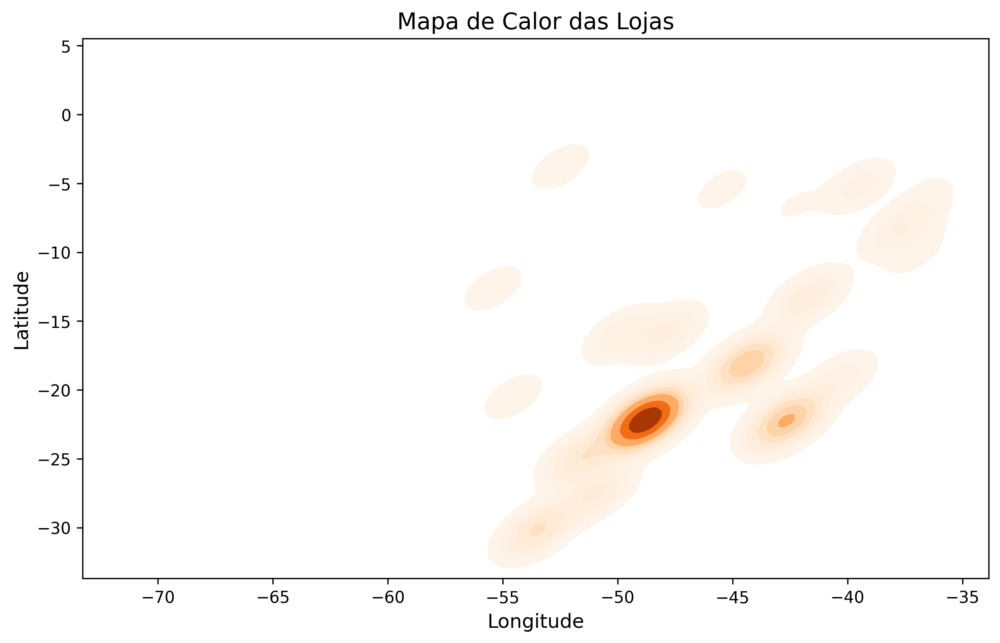

# 📊 Desafio Alura Store – Análise de Dados com Python e Matplotlib

## 🎯 Propósito da Análise

Este notebook tem como objetivo simular a rotina de uma analista de dados, por meio da resolução do desafio **Alura Store**, utilizando **Python** e **visualizações com Matplotlib**.

Esta atividade faz parte essencial do programa **Oracle Next Education (ONE)**, permitindo aplicar na prática conceitos importantes como:

- Leitura e manipulação de dados com **Pandas**  
- Geração de **gráficos** com **Matplotlib**
- Interpretação de **insights visuais** a partir de dados reais de vendas

---

## 🧠 Estrutura da Análise

Todo o projeto foi desenvolvido diretamente no Google Colab, sem necessidade de estrutura de pastas. O notebook está dividido nas seguintes seções:

1. **Importação de Bibliotecas e Leitura de Dados**  
   Leitura de arquivos CSV diretamente de URLs.

2. **Análise do Faturamento**  
   Cálculo e visualização do faturamento total por loja.

3. **Vendas por Categoria**  
   Avaliação das categorias mais vendidas nas lojas.

4. **Média de Avaliação das Lojas**  
   Comparativo entre a média de avaliação dos clientes por loja.

5. **Produtos Mais e Menos Vendidos**  
   Identificação dos produtos com melhor e pior desempenho em vendas.

6. **Frete Médio por Loja**  
   Análise comparativa do custo médio de frete por loja.
   
7. **Relatório e Recomendação Final**  
   Consolidação de todos os dados analisados e sugestão de qual loja o Sr. João deve vender, baseada em métricas como faturamento, avaliações, custo de frete e performance de produtos.
   

---

## 📈 Exemplos de Gráficos e Insights

- **Faturamento por Loja:**  
  Identificar quais lojas estão performando melhor em termos de receita e quais precisam de mais atenção para melhorar as vendas.
  

- **Vendas por Categoria:**
  Verificar quais categorias de produtos geram maior faturamento.
  Exemplo da Loja4:
 

- **Média de Avaliações:**
  Analisar a média das avaliações por loja.
  

- **Produtos Mais Vendidos:**
  Mostrar os produtos mais e menos vendidos, por loja, para identificar padrões de preferência.
 

- **Frete Médio por Loja:**
  Avaliar o custo médio de frete por loja.
  

- **Relatório Final:**
  Resumo consolidado de todas as análises, com o objetivo de responder à questão central:
  *O Sr. João possui quatro lojas e pretende vender uma delas. Com base nos dados, será feita uma análise para auxiliar na melhor decisão.*
  Verificamos a diferença entre a loja com melhor faturamento e a loja com o menor faturamento:
  
  Dentre outras análises.
- **Análise de Desemprenho Geográfico:**
  Análise da distribuição geográfica das lojas e suas vendas por região, observando a influência da localização no desempenho comercial.
  
---

## ▶️ Como Executar o Notebook

1. **Abra o notebook no Google Colab.**
2. **Execute as células na ordem em que aparecem.**
 
   Os dados são carregados automaticamente das seguintes URLs:

```python
import pandas as pd

url1 = "https://raw.githubusercontent.com/alura-es-cursos/challenge1-data-science/refs/heads/main/base-de-dados-challenge-1/loja_1.csv"
url2 = "https://raw.githubusercontent.com/alura-es-cursos/challenge1-data-science/refs/heads/main/base-de-dados-challenge-1/loja_2.csv"
url3 = "https://raw.githubusercontent.com/alura-es-cursos/challenge1-data-science/refs/heads/main/base-de-dados-challenge-1/loja_3.csv"
url4 = "https://raw.githubusercontent.com/alura-es-cursos/challenge1-data-science/refs/heads/main/base-de-dados-challenge-1/loja_4.csv"

loja = pd.read_csv(url1)
loja2 = pd.read_csv(url2)
loja3 = pd.read_csv(url3)
loja4 = pd.read_csv(url4)
```
3. **Execute as células na ordem em que aparecem.**
   
   Certifique-se de ter as bibliotecas **pandas** e **matplotlib** disponíveis.  
   No Colab, elas já vêm instaladas por padrão.


---
## 📌 Conclusão
Este desafio permitiu explorar dados reais de vendas, aplicar técnicas de visualização com Matplotlib e extrair insights valiosos que simulam a rotina prática de um analista de dados. A experiência contribui diretamente para a formação sólida na especialização em Data Science do programa ONE.

---
📚 Desafio desenvolvido como parte do programa Oracle Next Education - Alura, por Tayara Cruz.

